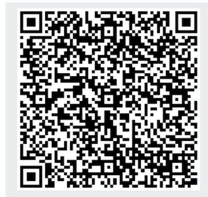
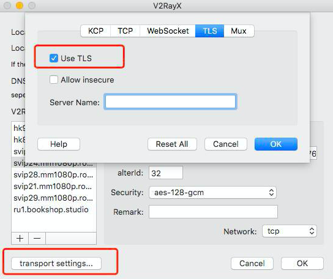
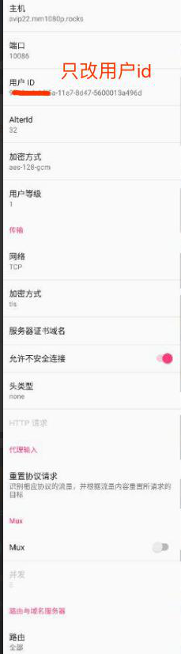

## 0.邮件列表
[地址](https://groups.google.com/forum/#!forum/mm1080p)

## 1.酸酸乳教程
### 1.1 酸酸乳客户端
- [windows](https://github.com/shadowsocksr-backup/shadowsocksr-csharp/releases)
- [android](https://github.com/shadowsocksr-backup/shadowsocksr-android/releases)
- [mac](https://github.com/qinyuhang/ShadowsocksX-NG-R/releases)
- [ios](https://itunes.apple.com/us/app/quantumult/id1252015438?mt=8)

### 1.2 扫描二维码

### 1.3 设置协议参数
端口:密码 
说明这种方法仅使用于端口范围在在 9680 至 9870 之间的同学，如果您的端口不在这个范围内。扫描二维码之后直接修改端口和密码即可。

## 2.v2 教程
### 2.1 v2 客户端
- [windows](https://github.com/2dust/v2rayN/releases)
- [android](https://play.google.com/store/apps/details?id=com.github.dawndiy.bifrostv)
- [mac](https://github.com/Cenmrev/V2RayX)
- [ios](https://itunes.apple.com/us/app/kitsunebi/id1275446921?mt=8)

### 2.2 windows 例子

### 2.3 mac 例子 

### 2.4 kit ios 例子

### 2.5 安卓例子

