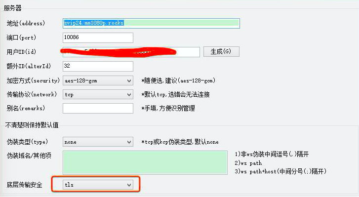

## 0.邮件列表
[地址](https://groups.google.com/forum/#!forum/mm1080p)

## 1.酸酸乳教程
### 1.1 下载酸酸乳客户端
- [windows](https://github.com/shadowsocksr-backup/shadowsocksr-csharp/releases)
- [android](https://github.com/shadowsocksr-backup/shadowsocksr-android/releases)
- [mac](https://github.com/qinyuhang/ShadowsocksX-NG-R/releases)
- [ios](https://itunes.apple.com/us/app/quantumult/id1252015438?mt=8)

### 1.2 扫描二维码配置
将邮件中的三个 ssr://xxx 地址分别生成二维码，使用酸酸乳客户端扫描即可自动配置。二维码生成工具：http://cli.im

群组在 telegram 上面，在 telegram @netflixone 即可加入群组。

## 2.v2 教程
### 2.1 v2 客户端
- [windows](https://github.com/2dust/v2rayN/releases)
- [android](https://play.google.com/store/apps/details?id=com.github.dawndiy.bifrostv)
- [mac](https://github.com/Cenmrev/V2RayX)
- [ios](https://itunes.apple.com/us/app/kitsunebi/id1275446921?mt=8)

### 2.2 windows 例子

### 2.3 mac 例子 

### 2.4 kit ios 例子

### 2.5 安卓例子

