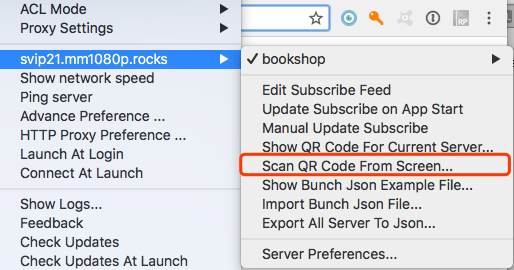

### 酸酸乳教程

#### 1.1 酸酸乳客户端
- [windows](https://github.com/shadowsocksr-backup/shadowsocksr-csharp/releases)
- [android](https://github.com/shadowsocksr-backup/shadowsocksr-android/releases)
- [mac](https://github.com/qinyuhang/ShadowsocksX-NG-R/releases)
- [ios](https://itunes.apple.com/us/app/quantumult/id1252015438?mt=8)

#### 1.2 扫描二维码配置
将邮件中的三个 ssr://xxx 地址分别生成二维码，使用酸酸乳客户端扫描即可自动配置。

二维码生成工具：http://cli.im

#### 1.3 mac 酸酸客户端扫描二维码例子



#### 1.4 linux mac 配置
拉代码
```
git clone https://github.com/shadowsocksr-backup/shadowsocksr.git
```
配置文件
```
{
    "server": "ru1.bookshop.studio",
    "server_ipv6": "::",
    "server_port": 443,
    "local_address": "127.0.0.1",
    "local_port": 1088,

    "password": "123456",
    "method": "aes-256-cfb",
    "protocol": "auth_aes128_md5",
    "protocol_param": "端口:密码",
    "obfs": "tls1.2_ticket_auth",
    "obfs_param": "",
    "speed_limit_per_con": 0,
    "speed_limit_per_user": 0,

    "additional_ports" : {},
    "additional_ports_only" : false, 
    "timeout": 120,
    "udp_timeout": 60,
    "dns_ipv6": false,
    "connect_verbose_info": 0,
    "redirect": "",
    "fast_open": false
}
```
说明：
443 端口这种配置方法适用于端口大于 9680 的新同学，如果你是之前老同学。直接修改 server_port 和 password 即可，protocol_param 空白。

配置并且启动 ssr 客户端
```
> vim ssr_local.json    然后填入上面的配置文件内容
> /root/shadowsocksr/shadowsocks/local.py -c /root/ssr_local.json -d start
```
