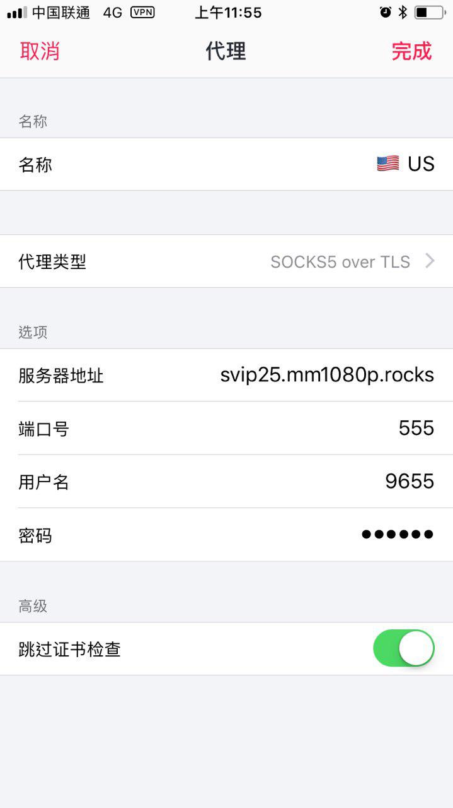

为广大 surge 用户提供全面的支持，支持 surge mac 和 surge ios 版本。

#### surge 配置文件添加
```
svip21.mm1080p.rocks = socks5-tls, svip21.mm1080p.rocks, 555, 酸酸乳端口, 酸酸乳密码, skip-cert-verify=true
svip22.mm1080p.rocks = socks5-tls, svip22.mm1080p.rocks, 555, 酸酸乳端口, 酸酸乳密码, skip-cert-verify=true
svip23.mm1080p.rocks = socks5-tls, svip23.mm1080p.rocks, 555, 酸酸乳端口, 酸酸乳密码, skip-cert-verify=true
->
svip32
```

#### surge ios 配置
填写自己的酸酸乳端口和酸酸乳密码即可

