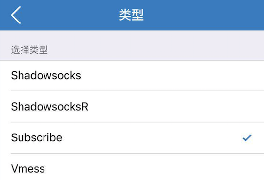

### ssr 订阅模式
#### 1.订阅地址
```
https://books.dsh.li/ssr?password=123456&port=9977
```
把这里的 9977 换成你自己的端口，123456 换成你自己的密码即可。

#### 2.shadowrocket 配置


#### 3.quantumult 配置
参考 rix 的[教程](https://docs.rixcloud.com/iOS/Quantumult/Guides/)

#### 其他
如果你发现 mac 或者 windows 下订阅模式有问题，可以先把客户端升级到最新版本。
