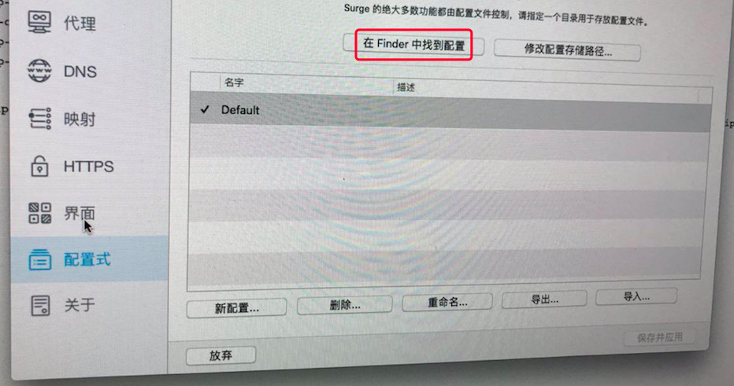
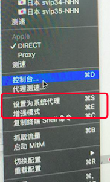

### 1 下载 surge mac
地址 https://nssurge.com (14 天的试用期)

### 2 配置
先打开 surge mac 配置文件夹

浏览器打开书店的 surge 订阅地址，然后替换掉 Default.conf 里面的内容。之后保存配置文件即可。

重新加载 surge 配置就看到了代理服务器列表了

### 3 打开系统代理模式
这样浏览器就会走 surge 了

### 4 打开增强模式
这样所有的系统流量都会走 surge 了，类似于 VPN 了。只不过是规则模式。telegram dropbox 这些就不再需要单独设置 socks5 代理。

