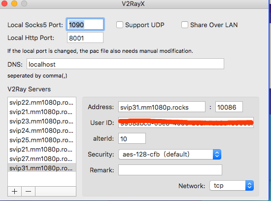
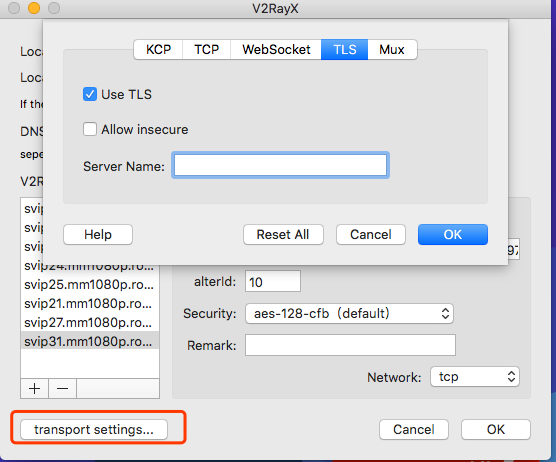
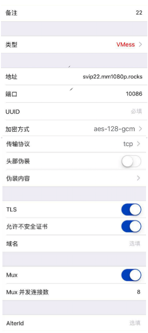

### v2 教程
#### 1 v2 客户端
- [windows](https://github.com/2dust/v2rayN/releases)
- [android](https://play.google.com/store/apps/details?id=com.github.dawndiy.bifrostv)
- [mac](https://github.com/Cenmrev/V2RayX)
- [ios](https://itunes.apple.com/us/app/kitsunebi/id1275446921?mt=8)

#### 2 mac V2rayX 例子 
AlterID=10 v2ray 配置你只需要改 uid 端口就是 10086 

#### 3 quantumult

