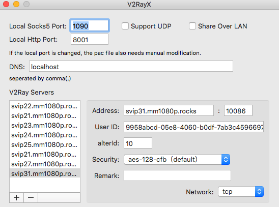

### v2 教程
#### 1 v2 客户端
- [windows](https://github.com/2dust/v2rayN/releases)
- [android](https://play.google.com/store/apps/details?id=com.github.dawndiy.bifrostv)
- [mac](https://github.com/Cenmrev/V2RayX)
- [ios](https://itunes.apple.com/us/app/kitsunebi/id1275446921?mt=8)

#### 2 windows V2rayN 例子
AlterID=10 v2ray 配置你只需要改 uid 端口就是 10086 不需要更改 切记！

#### 3 mac V2rayX 例子 


#### 4 安卓例子


#### 5.shadowrocket v2ray 配置
扫描下面的二维码 把 uid 改成你自己的即可


#### 6.手动配置文件
```
{
  "log": {
    "loglevel": "warning"
  },

  "inbound": {
    "port": 1081,
    "listen": "127.0.0.1",
    "protocol": "socks",
    "settings": {
      "auth": "noauth",
      "udp": false,
      "ip": "127.0.0.1"
    }
  },

  "outbound": {
    "protocol": "vmess",

    "settings": {
      "vnext": [{
        "address": "svip21.mm1080p.rocks",
        "port": 10086,
        "users": [{
          "id": " ",
          "alterId": 10
        }]
      }]
    },

    "streamSettings": {
      "network": "tcp",
      "security": "tls"
    }
  },

  "policy": {
    "levels": {
      "0": {
        "uplinkOnly": 0
      }
    }
  }
}
```
